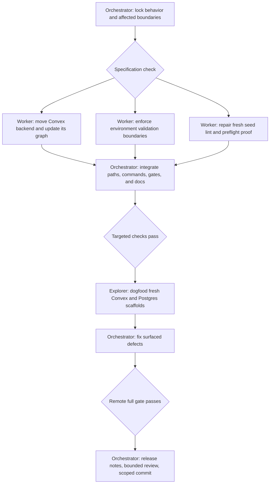

# Release hardening: Convex layout, environment validation, and Postgres seed

## Background

The generated projects currently have three related release-hardening defects:

- Convex backend functions live inside `packages/convex/convex`, which mixes deployable backend source with the workspace package that exposes generated API types.
- Environment contracts declare required values, but some browser and server paths use hidden defaults or delay validation until after the application starts handling work.
- A fresh Postgres scaffold can report unsafe-type lint failures in `seeds/run.ts` because lint runs before workspace package declarations exist.

The desired state keeps product behavior stable while making the generated architecture and failure behavior explicit. Convex backend source lives at the repository root. Each execution boundary validates its applicable environment contract before it renders, listens, connects, migrates, or writes. The Postgres seed keeps its existing records and idempotency while passing type-aware lint from a fresh install.

## Done

- A generated Convex project stores backend functions and their tests under top-level `convex/`.
- `packages/convex/` is a workspace-only package that exports the generated Convex API. It does not own backend functions.
- Convex codegen, deployment, package exports, TypeScript checks, tests, Turbo outputs, gates, workflow triggers, and documentation use the new layout. Backend-only changes under `convex/**` trigger deployment.
- Every already-required environment value remains required at its applicable browser, server, build, or CLI boundary. Existing optional values remain optional.
- A missing, blank, or invalid required value produces an actionable error before the boundary serves traffic, renders the application, connects to a database, runs a migration, or writes seed data. A blank value contains only Unicode whitespace after trimming.
- Browser code validates only public values and never imports server secrets.
- The Postgres browser no longer substitutes localhost for missing public application or API URLs.
- Both variants declare `APP_ENV` as the same `dev | prod` enum. Browser rendering, API startup, Postgres seeding, and development-only Convex functions reject a missing or invalid value at their boundary.
- A fresh Postgres scaffold runs type-aware lint without unsafe-type findings in `seeds/run.ts`.
- The Postgres seed still creates the same three accounts and three deterministic sample records, remains idempotent, and remains restricted to `APP_ENV=dev`.
- Targeted tests, offline fresh-scaffold dogfood, and the full gate pass for both variants. Live Convex deployment, authentication, and seeding are required only when a valid deployment credential is available and are reported separately.

Out of scope: renaming or merging environment variables, loosening existing required values, changing seed data, enabling production seed execution, adding environment bootstrap, adding mock mode, or changing public developer commands without a compatibility wrapper.

## Behavior and system boundaries

Required blank strings are invalid. URL values must be valid URLs. Optional reset webhook URL and token remain independently optional because pairing them would change the current contract.

`APP_URL` and `SITE_URL` remain separate. `CONVEX_DEPLOYMENT` is managed by the Convex CLI rather than the application contract: the first `convex dev --once` may create it, while deployment may authenticate with `CONVEX_DEPLOY_KEY`. `LOG_LEVEL`, `OPENROUTER_API_KEY`, and existing authentication secrets remain required where their declared scope applies, even when the starter application does not yet consume them.

The root render path validates its public environment before application rendering. The Postgres browser requires `PUBLIC_APP_URL` and `PUBLIC_API_URL`; the Convex browser requires `VITE_CONVEX_URL`; the shared shell requires a valid `APP_ENV`. Validation errors name every missing or invalid public key and do not substitute localhost or development values. Server entry points validate their server and build values before they listen or do database work. Development-only Convex functions validate `APP_ENV` before executing. The seed validates the full Postgres contract and the development restriction before migrations or connections.

The package `@<app>/convex` remains the stable import boundary for application code. It is private and workspace-only, exports built JavaScript and declarations generated from `convex/_generated`, and no longer lists backend source as publishable package files. Moving the backend must not change Convex function names or web imports. Root `build`, `typecheck`, and `test` commands explicitly cover top-level `convex/`; package scripts remain as compatibility wrappers. The generated-output ignore rule lives under `convex/`, and Turbo does not claim a package-relative external output.

The environment library tests required string and redacted values against missing, whitespace-only, and valid input. URL and enum fields also cover malformed input. Each generated contract has a minimal valid parse test and an accumulated failure test. Boundary tests cover browser rendering, API startup, seed preflight, migration preflight, and Convex development functions.

The exact clean-scaffold Postgres acceptance check is `pnpm lint` immediately after install. The command prepares the API workspace dependency graph before type-aware Oxlint runs; seed imports continue to use package exports rather than source-relative paths.

## Execution

The Convex worker owns the moved backend, Convex package configuration, layout-specific gates, and their tests. The environment worker owns environment contracts and runtime boundaries, except the Postgres seed. The seed worker owns the Postgres seed and its fresh-lint preparation. The orchestrator owns shared documentation, backlog state, integration, and final verification.

## Anti-slop rules

- Do not replace workspace package imports with source-relative imports to hide missing build artifacts.
- Do not add silent defaults, automatic fallbacks, type assertions, shapeless guards, or swallowed validation errors.
- Do not expose server variables through browser adapters.
- Do not preflight `CONVEX_DEPLOYMENT` before Convex bootstrap or require it when `CONVEX_DEPLOY_KEY` is the supported authentication input.
- Do not change Convex function names, seed fixtures, seed credentials, or account roles.
- Do not edit generated template copies directly. Regenerate them through the existing copy script.
- Preserve unrelated worktree changes and do not stage scratchpad evidence or other agents' edits.
