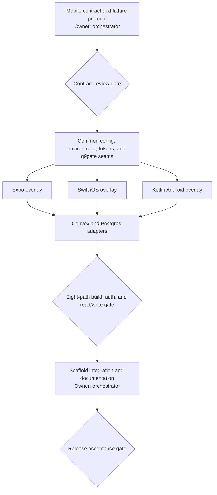

# Q9Stack — theory

## The bet

Shared engineering defaults should be maintained once and consumed as packages,
so each product can spend its complexity budget on its own domain. Q9Stack is a
project generator, quality-gate toolkit and reusable UI system, not a hosted
application or a universal product backend.

The approved stack and variant contracts below own intent. Source code owns
implementation details. [tracker.yaml](tracker.yaml) owns status and remaining
work, including stable B01–B27 roadmap IDs. There are no generated tracker
views: people and agents read the YAML directly or through `q9 tracker list` and
`q9 tracker show`. Dates in retained contracts are decision context, not release
certification.

## Scope boundaries

Templates stay thin. Applications own domain rules, secrets, operational policy,
retention decisions, provider accounts, thresholds and approved exceptions.
Integrations are explicit optional adapters; failed real services must never
silently select mock data. A successful scaffold is not a supported variant
until its authenticated starter workflow and required checks are proven.

Generated projects follow the same documentation pattern as this repository:
theory.md owns intent, tracker.yaml owns status and design.md owns visual
direction, and glossary.md owns the domain vocabulary. `q9 tracker check`
validates every tracker, so no project keeps its own copy of the tracker scripts.

## Sharing model

Work built in one product should reach the others without anyone copying files
between repositories. Every shared concern uses exactly one of four modes:

- A package holds code that is materially identical across projects and can be
  tested without project data. It ships as `@q9labsai/*`. Dev-time tooling such
  as the gates, configs and tracker suits this mode best, because a bad upgrade
  fails a gate in CI instead of breaking production.
- A recipe is a Markdown spec under `recipes/` for a concern whose invariants are
  shared but whose implementation depends on the stack, provider or data model.
  An agent applies it to each project.
- A scaffold default lives in the templates because only new projects need it.
  The project owns those files after generation.
- Product domain logic and capabilities that only one project needs stay in that
  project. q9stack doesn't accept them.

Every recipe names the problem, the reference implementation (the project and
paths where it was first built), notes for each supported stack, and a
conformance check that proves a project follows it. The check is preferably a
q9gate lane or a small test. Without a check nobody can see which projects have
drifted, so a recipe without one isn't accepted. Each product's AGENTS.md links
the recipes it follows.

A recipe becomes a package only after two projects run materially the same code
and a central upgrade is safer than local ownership. Looking infrastructural
isn't a reason to promote something.

q9stack is open source at `Q9Labs/q9stack`. Anyone can propose a recipe or report
a bug through an issue or pull request, and the promotion rule above decides
whether a proposal becomes a recipe or a package.

## Adoption order

Existing products come first. They adopt the gates, the `q9` CLI and the
first recipes before the new-product scaffold is finished. Candidate recipes come
from a harvest of Ava, Recruiter, Kaadr, Chalk, Murmur and Track. Platform
capabilities (B07–B27), mobile variants, polyglot gates and moving products onto
`ui`, `ai` and `voice` wait until a real product needs them, and then they start
as recipes.

## Agent CLI

`@q9labsai/cli` ships one `q9` command next to `q9gate`, so agents learn one
command and one `--help`. Projects call it through pnpm scripts, and AGENTS.md
lists those scripts, so agents keep running pnpm. Every subcommand supports
`--json`.

- `q9 tracker check|list|show` validates tracker.yaml in the gate and lets an
  agent find open items and read one item's acceptance criteria.
- `q9 dev start|status|logs|stop|reset` runs the dev server in the background
  with its output in `.logs/`, so an agent can read errors and stop only the
  processes it started. Projects wire it as `"dev": "q9 dev start -- <command>"`.
- `q9 changelog add|release|check|export` keeps `CHANGELOG.md` in Keep a
  Changelog format. `export` writes the user-facing entries as JSON, which the
  app bundles at build time for the changelog dialog. The dialog ships as a
  shadcn registry item that uses only semantic tokens and logical classes, so it
  takes on each project's theme and works in RTL. No GitHub token or runtime
  fetch is involved.
- `q9 diag` resolves a user-visible diagnostic code into the browser journey,
  server log and stack. It follows in 0.3 with a Convex adapter first.

## Observability

Every product runs two tools with different jobs. Q9 Diagnostics answers what
went wrong for one user in one session: it joins a redacted journey to the
server log through a diagnostic code and keeps data for 14 days. PostHog answers
what users do in aggregate: analytics, funnels, session replay, feature flags
and experiments. Where both run, PostHog events carry the diagnostic trace ID.
Convex queries and mutations can't call PostHog, so a flag that the server must
enforce is synced into Convex by an action.

## 1. Purpose

`q9stack` is the q9labs project template + the canonical static-check gates + the q9 design system, published as `@q9labsai/*` npm packages that both new projects (via `pnpm create q9stack`) and the existing fleet (track, chalk, kaadr, recruiter, Ava) **consume as dependencies**. Templates stay thin; gate code and UI code are never copied into a project.

## 2. Locked decisions

| #   | Concept                        | Decision                                                                                                                                                                                                                                                                                                                                                                                                                                                                                                                                                                                       | Reference to lift from                                                                                                                                                                                                                                                                      |
| --- | ------------------------------ | ---------------------------------------------------------------------------------------------------------------------------------------------------------------------------------------------------------------------------------------------------------------------------------------------------------------------------------------------------------------------------------------------------------------------------------------------------------------------------------------------------------------------------------------------------------------------------------------------- | ------------------------------------------------------------------------------------------------------------------------------------------------------------------------------------------------------------------------------------------------------------------------------------------- |
| 1   | Postgres access                | Effect SQL (`@effect/sql` + `@effect/sql-pg`), SQL-in-code migrations via Effect `Migrator`. No ORM.                                                                                                                                                                                                                                                                                                                                                                                                                                                                                           | kaadr `packages/database`                                                                                                                                                                                                                                                                   |
| 2   | Convex schema                  | Native `v.*` validators, discriminated unions (`v.union(v.object({kind: v.literal(...)}))`) over optional soup, `v.id()` everywhere, indexes declared in schema. Better Auth component. `convex codegen` in scripts.                                                                                                                                                                                                                                                                                                                                                                           | track `convex/`, recruiter `packages/convex` (layout + auth + codegen)                                                                                                                                                                                                                      |
| 3   | Web framework                  | TanStack Start on Cloudflare Workers via `@cloudflare/vite-plugin`; per-app `wrangler.jsonc`.                                                                                                                                                                                                                                                                                                                                                                                                                                                                                                  | kaadr `apps/web`, recruiter wrangler configs                                                                                                                                                                                                                                                |
| 4   | UI primitives                  | Base UI + `class-variance-authority`, no `asChild`, `tailwind-merge` `cn()`. shadcn registry style `base-mira`.                                                                                                                                                                                                                                                                                                                                                                                                                                                                                | chalk `packages/ui`, track `apps/web/src/components/ui`, design-atlas `packages/ui`                                                                                                                                                                                                         |
| 5   | Icons                          | One `Icon` wrapper over `@hugeicons/react` + `@hugeicons/core-free-icons`. No Lucide.                                                                                                                                                                                                                                                                                                                                                                                                                                                                                                          | kaadr `packages/ui/src/icon.tsx`                                                                                                                                                                                                                                                            |
| 6   | Tokens                         | Tailwind 4 CSS-first `@theme`; Geist + Geist Mono (self-hosted via `@fontsource-variable/geist`, `@fontsource-variable/geist-mono`); radius base `0.625rem`; neutral palette; `.dark` class for scheme; `[data-theme="<product>"]` for product palettes. Light + dark both shipped.                                                                                                                                                                                                                                                                                                            | kaadr `packages/design-system/*.css` (token structure), recruiter portal styles (product palettes)                                                                                                                                                                                          |
| 7   | Gate orchestrator              | Extract chalk `scripts/gates/smart-gate.mjs` into `@q9labsai/gates` as a TypeScript library + `q9gate` CLI with `gate.config.ts`. Lefthook pre-commit runs `q9gate run --staged`. No post-commit review hook by default.                                                                                                                                                                                                                                                                                                                                                                       | chalk `scripts/gates/*`, `shared gate scripts`, recruiter & Ava `scripts/gates/*`                                                                                                                                                                                                     |
| 8   | Lint/format                    | oxlint (type-aware via tsgolint, TS 7) + oxfmt. No Biome, no ESLint, no Prettier.                                                                                                                                                                                                                                                                                                                                                                                                                                                                                                              | chalk oxfmt config; track oxlint usage                                                                                                                                                                                                                                                      |
| 9   | Dead code / dupes / complexity | fallow (not knip).                                                                                                                                                                                                                                                                                                                                                                                                                                                                                                                                                                             | recruiter / Ava / chalk fallow config + baselines flow                                                                                                                                                                                                                                      |
| 10  | tracker.yaml                   | Versioned outcome, status and evidence schema, checked by `q9 tracker check`. No rendered views. theory.md owns intent and design.md owns visual direction.                                                                                                                                                                                                                                                                                                                                                                                                                                         | kaadr and track `tracker.yaml`                                                                                                                                                                                                                                                              |
| 11  | Glossary                       | Root `glossary.md`, kaadr's entry format.                                                                                                                                                                                                                                                                                                                                                                                                                                                                                                                                                      | kaadr `docs/product/glossary.md`                                                                                                                                                                                                                                                            |
| 12  | Changelog                      | q9stack packages: changesets. Scaffolded apps: `CHANGELOG.md` managed by `q9 changelog`, `[Unreleased]` + semver/date sections.                                                                                                                                                                                                                                                                                                                                                                                                                                                                                   | recruiter `CHANGELOG.md`                                                                                                                                                                                                                                                                    |
| 13  | AI                             | `@q9labsai/ai`: OpenRouter via `@openrouter/ai-sdk-provider` + Vercel AI SDK 6. Effect-wrapped core (model registry, ZDR options, typed errors) + a plain Promise entry for Convex actions.                                                                                                                                                                                                                                                                                                                                                                                                    | recruiter `packages/convex/convex/services/{openrouter,llm}.ts`, track central routing module                                                                                                                                                                                               |
| 14  | Voice                          | `@q9labsai/voice`: `VoiceCallClient` port with Ultravox adapter (web) and OpenAI Realtime adapter (WebRTC; server relay on Workers/Durable Objects).                                                                                                                                                                                                                                                                                                                                                                                                                                           | recruiter `VoiceCallClient`, kaadr Effect voice provider port, murmur realtime relay                                                                                                                                                                                                        |
| 15  | IaC                            | OpenTofu. `infra/` with `modules/` + `stacks/{dev,prod}`; Cloudflare provider (Workers, DNS, R2/KV as needed); remote state in S3 with native lockfile (`use_lockfile = true`), no DynamoDB. Lint lane: `tofu fmt -check`, `tofu validate`, `tflint`, `trivy config`.                                                                                                                                                                                                                                                                                                                          | kaadr `infra/`, recruiter state backend module                                                                                                                                                                                                                                              |
| 16  | Turbo                          | `concurrency: "50%"`; gate heavy lanes (typecheck, build, test, mutation) marked `exclusive`; `--continue` in CI.                                                                                                                                                                                                                                                                                                                                                                                                                                                                              | chalk turbo.json (as anti-pattern: "1")                                                                                                                                                                                                                                                     |
| 17  | License                        | Scaffold default: proprietary "Copyright (c) q9labs. All rights reserved." `--license mit` flag writes MIT. q9stack repo itself: MIT for packages.                                                                                                                                                                                                                                                                                                                                                                                                                                             | recruiter LICENSE (proprietary), track (MIT)                                                                                                                                                                                                                                                |
| 18  | Repo                           | GitHub `Q9Labs/q9stack`, npm scope `@q9labsai`.                                                                                                                                                                                                                                                                                                                                                                                                                                                                                                                            | —                                                                                                                                                                                                                                                                                           |
| 19  | TypeScript                     | 7.0.2 (tsgo). `@q9labsai/config-tsconfig` = strict + `noUncheckedIndexedAccess` + `exactOptionalPropertyTypes` + `verbatimModuleSyntax` + `isolatedModules` + `noPropertyAccessFromIndexSignature` + `forceConsistentCasingInFileNames`.                                                                                                                                                                                                                                                                                                                                                       | `shared strict TypeScript config`, recruiter tsconfig.base                                                                                                                                                                                                                             |
| 20  | Test                           | vitest 4; `passWithNoTests` forbidden (hygiene lane rejects it); fast-check for parsers/serializers; `expectTypeOf` type tests for branded IDs and unions; Stryker mutation lane nightly only.                                                                                                                                                                                                                                                                                                                                                                                                 | recruiter hygiene gate                                                                                                                                                                                                                                                                      |
| 21  | Mobile                         | Not in the template v1. Later work adds native Swift/iOS plus Kotlin/Android and Expo/React Native overlays as defined in [the mobile variant contract](#mobile-variant-contract).                                                                                                                                                                                                                                                                                                                                                                                                             | —                                                                                                                                                                                                                                                                                           |
| 22  | i18n + RTL                     | In base from day one: Lingui (`@lingui/core`, `@lingui/react`, Vite plugin, `lingui extract` catalogs under `apps/web/src/locales/<locale>/messages.po`), locales `en` (source) + `ar` (RTL sample); `<html lang dir>` driven by a `LocaleProvider`; all UI uses logical properties (`ms-/me-/ps-/pe-/start-/end-/text-start`) — physical `ml-/mr-/pl-/pr-/left-/right-` are forbidden in `@q9labsai/ui` and in template code (semgrep rule `q9.ui.no-physical-direction-classes`, shipped in `@q9labsai/config-semgrep`). The q9gate `i18n` lane checks catalog parity, ICU placeholders, Arabic plural forms and untranslated strings. Catalog drift = `lanes.contractDrift({ generate: "pnpm i18n:extract", paths: ["apps/web/src/locales"] })`. | kaadr Lingui setup                                                                                                                                                                                                                                                                          |
| 23  | Auth                           | Better Auth in BOTH variants (Convex: `@convex-dev/better-auth` component; Postgres: Better Auth `pg` adapter mounted in `apps/api`). Base ships `packages/auth` = the `AuthClient` port (`signIn`, `signUp`, `signOut`, `useSession`, `requestPasswordReset`, `listDevAccounts`, `switchDevAccount`) + the auth screens (sign-in, sign-up, forgot/reset, verify-email, profile) from `@q9labsai/ui/auth`; each overlay provides the adapter.                                                                                                                                                  | recruiter / track Better Auth wiring                                                                                                                                                                                                                                                        |
| 24  | Seeding                        | Convention + script in every variant: `pnpm seed` runs `seeds/` (deterministic `@faker-js/faker` with fixed seed; rich realistic data: 3 accounts — `admin@dev.local`, `member@dev.local`, `viewer@dev.local`, password `dev-password` — plus sample entities in every state of the core union). Prod-guarded (`APP_ENV !== "prod"`). `README.md` bootstrap section says: run `pnpm seed` after first `pnpm dev`.                                                                                                                                                                              | —                                                                                                                                                                                                                                                                                           |
| 25  | Dev account switcher           | Dev-only floating widget (`DevAccountSwitcher` from `@q9labsai/ui/auth`) listing seeded accounts; one click signs in as that account via the `AuthClient` port (email+password of seeded users). Rendered only when `APP_ENV !== "prod"`.                                                                                                                                                                                                                                                                                                                                                      | —                                                                                                                                                                                                                                                                                           |
| 26  | Preview gallery + tweaker      | `apps/web/src/routes/__preview/` (dev-only, prod-guarded): a gallery that renders every screen/component of the app in every state (loading, empty, error, populated, per role) from `*.preview.tsx` scenario files (`definePreview({ title, scenarios: [{ name, props                                                                                                                                                                                                                                                                                                                         | render }] })`), with a **tweaker** panel (`@q9labsai/ui/preview`: `PreviewGallery`, `Tweaker`controls: locale, dir, scheme, product theme, viewport width, role, scenario-specific knobs via`knob.select/boolean/text/number`). The `@q9labsai/ui` `preview/` app uses the same components. | —   |

Semantic rules that ride along (from `project code standards`): `as` banned except `as const`; shapeless `Record` banned; `isRecord` guards banned; suppressions need a `because|reason|intentional|safe|false positive` justification on the same line; hexagonal import direction enforced by depcruise.

## 3. Repository layout

```
q9stack/
├── package.json                  private, pnpm workspaces, turbo, changesets, q9gate (dogfood)
├── pnpm-workspace.yaml           packages/*, templates/base, templates/*/overlay-free dirs are NOT workspaces (see §5)
├── turbo.json                    concurrency 50%
├── tsconfig.json                 extends ./packages/config-tsconfig/tsconfig.base.json
├── gate.config.ts                q9stack's own lanes
├── lefthook.yml                  pre-commit: pnpm q9gate run --staged
├── .changeset/                   changesets config (packages only; templates ignored)
├── .github/workflows/ci.yml      q9gate run --base; scaffold-both-variants smoke job; publish on tag
├── packages/
│   ├── gates/                    @q9labsai/gates
│   ├── config-tsconfig/          @q9labsai/config-tsconfig
│   ├── config-oxlint/            @q9labsai/config-oxlint  (oxlint + oxfmt configs)
│   ├── config-semgrep/           @q9labsai/config-semgrep (rule packs as yml, exported by path)
│   ├── config-depcruise/         @q9labsai/config-depcruise (factory: makeHexagonalRules({ core, edges }))
│   ├── ui/                       @q9labsai/ui
│   ├── ai/                       @q9labsai/ai
│   ├── voice/                    @q9labsai/voice
│   ├── env/                      @q9labsai/env
│   ├── cli/                      @q9labsai/cli (`q9`: tracker, dev, changelog)
│   └── create-q9stack/           create-q9stack (bin)
├── recipes/                      shared Markdown recipes (see Sharing model)
├── templates/
│   ├── base/                     full project tree (see §5)
│   ├── with-convex/              overlay dir: files added/replaced on top of base
│   └── without-convex/           overlay dir
├── docs/                         spec.md (this), adr/NNNN-*.md (one per decision row above)
└── scratchpad/                   research, prompts, session logs (gitignored, never published)
```

Package naming: npm `@q9labsai/<dir>`; CLI bins: `q9gate` (gates), `q9` (cli), `create-q9stack`.

## 4. `@q9labsai/gates` — contract

### 4.1 `gate.config.ts` (project-owned; generated by `q9gate init`)

```ts
import { defineGate, lanes } from "@q9labsai/gates";

export default defineGate({
  workspaceRoots: ["apps", "packages", "convex"],
  classifiers: {
    source: [".ts", ".tsx", ".mjs", ".cjs", ".js", ".jsx"],
    docs: ["scratchpad/", "*.md", "*.mdx", "*.txt"],
    dependency: ["package.json", "pnpm-lock.yaml", "pnpm-workspace.yaml"],
    gateDefinition: ["gate.config.ts", "lefthook.yml", "turbo.json", ".github/workflows/"],
    infra: ["infra/"],
    contract: ["packages/contracts/", "convex/schema.ts"],
  },
  concurrency: "50%",
  lanes: [
    lanes.typecheck(),
    lanes.lint(),
    lanes.format(),
    lanes.test(),
    lanes.build(),
    lanes.fallow({ baselineDir: "gates/baselines/fallow" }),
    lanes.semgrep({
      packs: [
        "@q9labsai/config-semgrep/type-safety",
        "@q9labsai/config-semgrep/shape-heuristics",
        ".semgrep/project.yml",
      ],
    }),
    lanes.depcruise(),
    lanes.osv(),
    lanes.gitleaks(),
    lanes.cspell(),
    lanes.syncpack(),
    lanes.testPresence({ sourceRoots: ["apps/*/src", "packages/*/src"] }),
    lanes.reactDoctor(),
    lanes.shellcheck(),
    lanes.actionlint(),
    lanes.tofu(),
    lanes.contractDrift({ generate: "pnpm contracts:generate" }),
    lanes.envContract({
      schema: "packages/env/src/env.ts",
      sources: ["apps/*/wrangler.jsonc", ".env.example", "infra/stacks/*/outputs.tf"],
    }),
    lanes.bundleSize({ budgets: { "apps/web": "250 kB" } }),
    lanes.versionDrift(),
    lanes.hygiene(),
  ],
});
```

Each lane is `{ id, title, triggers: (ctx) => boolean | reason, run: (ctx) => Promise<LaneResult>, exclusive?: boolean, baseline?: BaselineSpec }`. `triggers` receives the classified diff and returns why it runs (printed). `ctx` provides `changedFiles`, `scope` (staged|branch|full), `base`, `repoRoot`, `exec`.

### 4.2 CLI

- `q9gate run [--staged | --base <ref> | --full] [--lane <id>...] [--concurrency N|%] [--json]` — plan, print plan with reasons, run via pool, write `gate.report.json`, exit non-zero on any failed lane.
- `q9gate init` — write `gate.config.ts`, `.semgrep/project.yml`, `gates/baselines/*` (empty), `lefthook.yml` snippet; never overwrite existing files without `--force`.
- `q9gate doctor` — hygiene: every script alias referenced exists, lanes don't mutate the tree, required CLIs installed (print install hints), baselines parse, no `passWithNoTests`.
- `q9gate why <file>` — which lanes a file triggers and why.
- `q9gate accept-baseline <lane> --message "<why>"` — the only way to raise a baseline; writes the message into the baseline file.

### 4.3 `gate.report.json` (schema v1)

```json
{
  "schemaVersion": 1,
  "repo": "q9stack",
  "ref": "abc123",
  "scope": "branch",
  "base": "origin/main",
  "startedAt": "...",
  "durationMs": 0,
  "concurrency": 4,
  "lanes": [
    {
      "id": "fallow",
      "status": "passed|failed|skipped",
      "reason": "12 source files changed",
      "durationMs": 0,
      "metrics": { "deadCode": 3, "dupes": 1, "complexityOverBaseline": 0 },
      "baseline": { "before": 14, "after": 14 },
      "findings": [{ "file": "...", "line": 1, "rule": "...", "message": "..." }]
    }
  ],
  "summary": { "passed": 0, "failed": 0, "skipped": 0 }
}
```

Every lane that can count emits `metrics`; the dashboard graphs them over time.

### 4.4 Baselines

Project-owned JSON under `gates/baselines/<lane>.json`: `{ "count": N, "entries": [...], "acceptedAt": "...", "message": "..." }`. A lane with a baseline fails if `count` rises; `accept-baseline` is the only writer.

## 5. Templates

`templates/base` is a complete, working project. Overlays contain only files that differ. `create-q9stack` copies base, then copies the overlay on top (overlay wins), then applies renames (`__APP_NAME__`, `__APP_SLUG__`, `__PRODUCT__`, `__YEAR__` tokens) and deletes files listed in the overlay's `.q9-remove` (one relative path per line).

Convex (`--convex`) is the default backend. Choose Postgres (`--postgres`) when the
product is expected to run on-premises or is an enterprise product. Both variants are first-class and must pass the same starter
workflow and gates.

### 5.1 `templates/base`

```
base/
├── package.json, pnpm-workspace.yaml (catalog: pinned versions), turbo.json, tsconfig.json, gate.config.ts, lefthook.yml
├── .github/workflows/{ci.yml, nightly.yml (mutation), deploy.yml}, .github/dependabot.yml (grouped @q9labsai/* updates)
├── .oxlintrc.json (extends @q9labsai/config-oxlint), .oxfmtrc.json, .semgrep/project.yml, .dependency-cruiser.cjs, cspell.config.yaml
├── gates/baselines/ (empty seeds), osv-baseline.json
├── AGENTS.md, CLAUDE.md (both: the stack-generic rules only, lifted from kaadr/recruiter/track + pointer to glossary.md, theory.md and tracker.yaml), glossary.md (seed entries), theory.md, tracker.yaml and design.md (seeds; the tracker is checked by `q9 tracker`), CHANGELOG.md (managed by `q9 changelog`), README.md, LICENSE (token-driven)
├── docs/ (adr/ with ADR template, product/, runbooks/)
├── infra/ (OpenTofu modules + stacks, backend.tf with S3 native lock, providers: cloudflare; `tflint.hcl`)
├── apps/web/            TanStack Start, @cloudflare/vite-plugin, wrangler.jsonc, uses @q9labsai/ui shell + tokens, one sample route, health route, env via @q9labsai/env
├── packages/core/       domain core (pure; depcruise-protected) with one sample entity + Schema
├── packages/env/        typed env contract (one file, @q9labsai/env helpers); required values fail at their browser, server, or CLI boundary before work starts
├── packages/auth/       AuthClient port + DevAccountSwitcher wiring + auth routes (screens from @q9labsai/ui/auth); adapter supplied by overlay
├── seeds/               seed runner contract + fixtures (faker, fixed seed); `pnpm seed`
└── packages/contracts/  (without-convex only via overlay; base has an empty placeholder README)
```

Also in base `apps/web`: Lingui provider + `en`/`ar` catalogs + locale switcher; `__preview` gallery route with tweaker; auth routes `/sign-in`, `/sign-up`, `/forgot-password`, `/reset-password`, `/verify-email`, `/settings/profile`.

### 5.2 `templates/with-convex` overlay

- `convex/` owns the backend: `schema.ts` (sample table with a discriminated union + index), `auth.ts` (Better Auth component), one query/mutation/action with validators, root `convex.json`, gitignored `_generated`, tests, and root quality commands.
- `packages/convex/` is the private workspace package that exposes the generated API to application code. It does not own backend functions.
- `apps/web` wiring: Convex provider + Better Auth client.
- `gate.config.ts` adds `lanes.convexCodegenDrift()` (runs `convex codegen` and diffs).
- `packages/auth` adapter over `@convex-dev/better-auth`; `seeds/` implemented as an internal Convex mutation (`internal.seed.run`) invoked by `pnpm seed`.
- `.q9-remove`: `packages/contracts/README.md`.

### 5.3 `templates/without-convex` overlay

- `apps/api/` — Effect Platform `HttpApi` on Node (kaadr pattern), `@effect/sql-pg` layer, migrations dir with one migration, health endpoint, Dockerfile.
- `packages/contracts/` — `HttpApi` groups + OpenAPI generation script → `packages/contracts/openapi.json`; `contracts:generate` also emits a typed client into `packages/sdk/`.
- `packages/database/` — sql layer, migrator, branded ID helpers.
- `gate.config.ts` adds `lanes.contractDrift(...)` and a `migrationSafety` lane (forbids `DROP`/`ALTER ... TYPE` without `-- expand-contract:` annotation).
- `infra/`: adds the Postgres provider/secret outputs.
- Better Auth mounted in `apps/api` with the `pg` adapter (`/api/auth/*`), `packages/auth` adapter = Better Auth client pointed at the API; `seeds/` runs deterministic, development-only fixtures via Effect SQL (`pnpm seed`) after environment preflight.

### 5.4 Development workflows

- Root `pnpm dev` prepares the compiled workspace dependency closure before it starts the variant's web and backend development processes. It then watches those packages, so no manual production build is required before development and package edits remain live.
- `cd apps/web && pnpm dev` and root `pnpm web:dev` prepare and watch only the web dependency closure, then start the web app against a configured real API. They do not start the generated API, Convex backend, database, migrations, or seeds.
- Full-stack development fails clearly when its explicit environment or infrastructure prerequisites are unavailable. Real-API web development never falls back to mock data after a connection failure.
- `pnpm dev:mock` and root `pnpm web:mock` select a typed in-process mock adapter at the web application boundary. Mock mode requires no real API or database, includes deterministic authentication and useful contract-typed fixtures, keeps mutations in memory, and resets on refresh or development-server restart.
- Generated workspace packages keep their declared compiled exports in development and production. Turbo runs finite preparation before persistent application servers, and each server starts only its required package-owned watchers as sidecars; source aliases and install-time builds are not part of the contract.

## 6. `@q9labsai/ui` — contract

RTL-first: logical properties only; `dir` handled by `ThemeProvider`/`LocaleProvider`; every primitive renders correctly under `dir="rtl"` (the preview app shows both). Extra entries: `./auth` (presentational screens `SignInForm`, `SignUpForm`, `ForgotPasswordForm`, `ResetPasswordForm`, `VerifyEmailNotice`, `ProfileForm`, `AuthLayout`, `DevAccountSwitcher` — callbacks in, no auth library dependency) and `./preview` (`PreviewGallery`, `Tweaker`, `definePreview`, `knob.*`).

Exports: `tokens.css` (import side-effect), `cn`, `Icon`, primitives (Button, Input, Textarea, Select, Checkbox, Switch, Dialog, Sheet, Popover, Tooltip, DropdownMenu, Tabs, Toast, Card, Badge, Separator, Skeleton, Table, EmptyState, Spinner), `AppShell` (sidebar + topbar + main + mobile drawer), `ThemeProvider` (`.dark` + `data-theme`), `useTheme`. Built with tsdown/tsup to ESM + `.d.ts`; CSS shipped as a file export. Storybook is out of scope; a `preview/` route in the q9stack repo renders every primitive (used by react-doctor + visual sanity).

## 7. `@q9labsai/ai`, `@q9labsai/voice`, `@q9labsai/env` — contracts

- `ai`: `makeOpenRouter({ apiKey, models, zdr })` → AI SDK provider; `ModelRegistry` (named roles → model ids; default `openai/gpt-5.6-luna`); `Effect` service `LanguageModel` with tagged errors (`RateLimited`, `ProviderUnavailable`, `InvalidResponse`); `streamText`/`generateObject` wrappers; plain `createClient()` for non-Effect contexts (Convex actions). Includes cost/usage logging hook.
- `voice`: `VoiceCallClient` interface (`start`, `stop`, `on(event)`, `sendTool`), `UltravoxCallClient`, `OpenAIRealtimeCallClient`; server helpers: `createUltravoxCall` (token), `createRealtimeSession` (ephemeral key) for Workers.
- `env`: `defineEnv(schema)` using Effect `Config` (and a `zod` adapter), producing `{ parse(source), keys(), schemaJson() }`; the env-contract lane uses `keys()`.

## 8. Fleet upgrades

Products receive q9stack upgrades through Dependabot. Each repository's
`.github/dependabot.yml` groups every `@q9labsai/*` update into one pull request,
and the product's own q9gate run decides whether the upgrade is safe to merge.
q9stack ships no fleet CLI or dashboard, because the open Dependabot pull
requests already show which repositories are behind.

## Mobile variant contract

### Background

Responsive web components do not establish mobile support. Each mobile variant needs its own scaffold, authentication, backend, build and device proof; current readiness belongs in tracker.yaml.

The desired state is one template system with two optional mobile variants:

- **Native** generates separate iOS and Android applications. iOS uses Swift and SwiftUI. Android uses Kotlin and Jetpack Compose. The applications do not share a Kotlin Multiplatform runtime.
- **Expo** generates one TypeScript application using React Native, Expo, and Expo Router for iOS and Android.

Mobile is an overlay, not a separate q9stack product. The mobile choice is independent of the backend choice, and a generated repository may contain web and mobile applications together. A future mobile-only option can omit web without changing the variant contract.

q9stack remains template-first. This specification does not require automated migration tooling for existing mobile applications.

### Canonical terms

- **Mobile variant:** either `native` or `expo`.
- **Native pair:** the separate Swift/iOS and Kotlin/Android applications generated by the native variant.
- **Selected backend:** the q9stack Convex or Postgres backend selected for the repository.
- **Backend wiring:** authenticated, typed application access to the selected backend. It never means embedding server database credentials in a mobile application.
- **Starter flow:** a small, removable read/write workflow that proves the generated mobile application, authentication, contract, and backend work together.

### Variant contract

The scaffold interface is:

```text
--mobile native  -> apps/ios + apps/android
--mobile expo    -> apps/mobile
```

The selected backend remains an independent scaffold choice. `--mobile` is optional, so existing web-only output does not change. A later `--no-web` option may produce a mobile-only repository, but it is not required for the first mobile release.

| Concern                    | Native variant                                                        | Expo variant                                                                    |
| -------------------------- | --------------------------------------------------------------------- | ------------------------------------------------------------------------------- |
| Applications               | `apps/ios`, `apps/android`                                            | `apps/mobile`                                                                   |
| Language and UI            | Swift with SwiftUI; Kotlin with Jetpack Compose and Material 3        | TypeScript with React Native, Expo, and Expo Router                             |
| Concurrency                | Swift Concurrency; Kotlin coroutines and Flow                         | React Native and Expo async conventions                                         |
| Tests                      | Swift Testing and platform UI tests; Kotlin unit and Compose UI tests | TypeScript unit tests and platform end-to-end smoke tests                       |
| Shared application runtime | None between iOS and Android                                          | One React Native application across iOS and Android                             |
| q9stack depth              | Shape-first, with native build and backend adapters                   | Shape plus reusable TypeScript configs, gates, environment parsing, and clients |

The native pair may share generated API schemas, design tokens, copy, asset sources, and analytics event names. It must not introduce Kotlin Multiplatform, a shared native domain runtime, or a custom cross-platform UI layer by default.

### Backend and authentication wiring

Every supported mobile and backend combination must ship with a working starter flow. A variant is not supported merely because its project compiles.

| Selected backend | Expo                                                                            | Native iOS                                                  | Native Android                                               |
| ---------------- | ------------------------------------------------------------------------------- | ----------------------------------------------------------- | ------------------------------------------------------------ |
| Convex           | Use the Convex React Native client and generated Convex API                     | Use the Convex Swift client and generated contract adapters | Use the Convex Kotlin client and generated contract adapters |
| Postgres         | Use the authenticated typed client generated from the q9stack HTTP API contract | Generate or maintain a typed Swift HTTP API client          | Generate or maintain a typed Kotlin HTTP API client          |

Postgres and any future server database stay behind the q9stack API. A mobile artifact must never contain a database connection string or privileged server credential.

Backend wiring includes:

1. The app selects the correct local, development, staging, or production backend endpoint through platform-appropriate public configuration.
2. Sign-in, session restoration, authenticated requests, expiry handling, and sign-out work through the q9stack authentication boundary.
3. Generated or checked contract types cover the starter flow. Mobile code does not pass shapeless JSON through the application boundary.
4. The starter flow performs at least one authenticated read and one authenticated write against the selected backend.
5. Loading, empty, offline, expired-session, validation-error, and unavailable-backend states have explicit behavior.

The Convex data clients for Expo, Swift, and Kotlin do not by themselves prove compatibility with q9stack's Better Auth setup. Each platform and backend combination must pass the authentication fixture before q9stack marks it supported. If a native Convex client cannot consume the selected session directly, q9stack must provide a narrow mobile session adapter or route the operation through the authenticated API. The template must not hide this gap behind a mock or unauthenticated fallback.

### Foundation provided by q9stack

Each variant provides these working defaults:

- Project structure, formatting, linting, tests, builds, and q9gate orchestration appropriate to its toolchain.
- Environment parsing with actionable failures for missing or invalid public configuration. Secrets stay at server boundaries.
- Authentication wiring and secure session storage through Keychain on iOS and Keystore-backed storage on Android. Expo uses an equivalent supported secure-storage adapter.
- Typed backend clients, contract drift checks where generation is available, and the starter flow.
- Navigation, theme selection, generated design tokens, deep-link configuration, and accessibility-ready screen structure.
- Explicit loading, error, retry, and network-state primitives. Automatic retries are limited to safe or idempotent operations.
- Logging, crash-reporting, and analytics interfaces that remain disabled until the application selects and configures providers.
- Stable application identifiers, local development commands, CI build shapes, and documented release seams.
- Unit tests plus an integration fixture for every supported mobile and backend combination.
- An explicit mock mode at the application data boundary. It never activates automatically when the real backend fails.

q9stack provides design tokens and platform conventions, not one shared UI implementation. The web UI package is not imported into React Native, SwiftUI, or Compose applications.

### Application-owned decisions

The generated application owns:

- Its domain schema, product screens, workflows, and authorization policy.
- State-management choices beyond the starter architecture.
- General local persistence, caching, synchronization, conflict resolution, and offline-first behavior.
- Product-specific integrations such as push notifications, camera access, alarms, voice, background work, maps, and payments.
- Provider selection and consent behavior for analytics and crash reporting.
- Store listings, signing identities, certificates, provisioning profiles, rollout policy, and production credentials.

q9stack may add separate overlays for recurring capabilities later. They are not part of the base mobile variants.

### Observable completion criteria

The mobile epic is complete when:

1. The scaffold generates Expo plus Convex, Expo plus Postgres, native pair plus Convex, and native pair plus Postgres repositories without manual structural repair.
2. Every generated application builds with its supported toolchain and passes its q9gate lanes.
3. Every application can select an environment, sign in, restore a session, run the authenticated starter read/write flow, handle an expired session, and sign out.
4. Contract or schema drift fails the relevant gate before stale clients ship.
5. No mobile source, generated configuration, log, fixture, or artifact contains a server database credential or signing secret.
6. Integration fixtures prove all eight platform/backend application paths: Expo iOS and Android for each backend, plus native iOS and Android for each backend.
7. The generated README explains local development, mock mode, backend setup, platform builds, configuration, and the release seam.

It is acceptable for signing and store publication to remain manual. It is not acceptable for the template to claim support for a combination whose build, authentication, or starter flow is unproved.

### Execution shape



Phase status and remaining work live under B09 in [tracker.yaml](tracker.yaml).

### Anti-slop rules

- Do not connect a mobile application directly to Postgres or another server database.
- Do not treat successful compilation as proof that backend authentication works.
- Do not ship demo credentials, automatic unauthenticated fallbacks, or automatic mock fallback.
- Do not treat Expo Go as the production development or release contract. Use development builds when native configuration or libraries are involved.
- Do not reuse web components inside mobile applications merely because both Expo and web use React.
- Do not introduce Kotlin Multiplatform, a shared native runtime, a state-management framework, or an offline database without a product requirement.
- Do not make store publication or signing credentials a prerequisite for local development and CI verification.
- Do not expand the Murmur or Track foundation migrations to implement this epic.

## Tracker maintenance

Keep generator and gate contracts visible while basic package-consumption/setup inventory belongs in package documentation. Retain approved unresolved roadmap IDs and credit implemented foundations when describing remaining work. A broader contract must not be described as wholly absent because only part of it is missing; old runtime reports need current reproduction.

Only tracker.yaml owns current status. Retire basic completed entries when they no longer guide decisions; retain meaningful invariants and unresolved scope. Each surviving claim needs dated, scoped source or execution evidence. An audit date is not a release certification.
